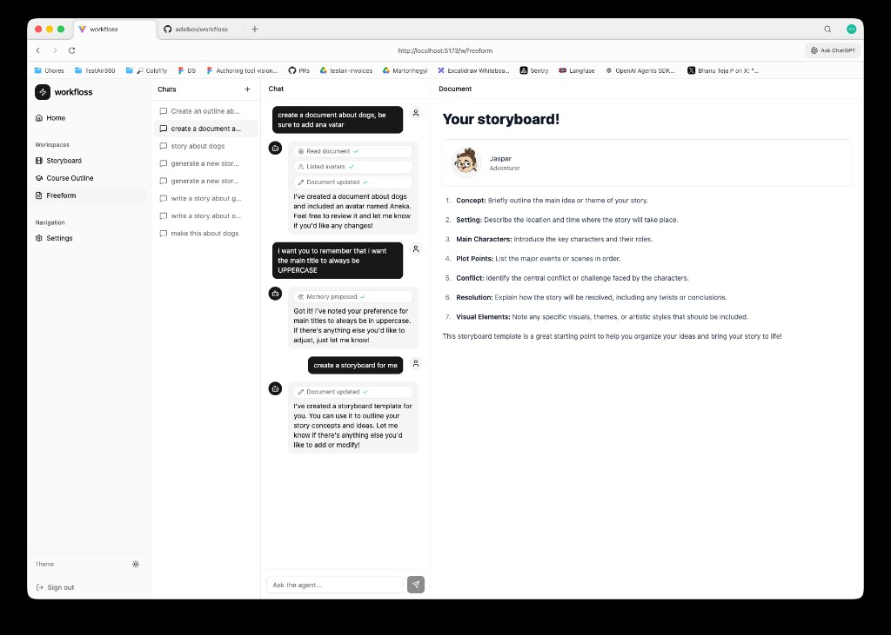

# Workfloss

AI-powered document editor with a chat sidebar. Talk to specialized agents that read, write, and edit documents in a live TipTap editor — while remembering things about you across sessions.



## Stack

- **Frontend** — React 19, Vite, TipTap, Tailwind CSS 4, Radix UI, shadcn
- **Backend** — [Convex](https://convex.dev) (realtime DB, functions, scheduling)
- **AI** — [`@convex-dev/agent`](https://github.com/get-convex/agent) + OpenAI GPT-4o via AI SDK
- **Auth** — `@convex-dev/auth`

## Agentic Features

**Multi-agent setup** — Three specialized agents (freeform editor, storyboard writer, course outline designer) share a common tool set but carry domain-specific system prompts. Routed by document type at runtime.

**Tool calls** — Agents use tools to interact with the system:
- `readDocument` / `replaceDocument` — read and write document HTML through Convex mutations
- `listAvatars` — query available avatar assets
- `proposeMemory` — suggest facts to save to long-term memory (user confirms before persisting)

**Semantic memory** — A `proposeMemory` tool lets agents extract user facts, preferences, and project context. Confirmed memories are injected into every future conversation via a `contextHandler`, giving agents persistent recall across sessions.

**Live document editing** — Agents write HTML directly into the document via `replaceDocument`. The frontend picks up `pendingContent` reactively and applies it to the TipTap editor, so edits appear in real time alongside the chat.

## Getting Started

```bash
# Install dependencies
npm install

# Set up Convex (will prompt for project link on first run)
npx convex dev

# In another terminal, start the frontend
npm run dev
```

Or run both at once:

```bash
npm run dev        # runs vite + convex dev in parallel
```

### Environment Variables

Set these in your Convex dashboard (Settings → Environment Variables):

| Variable | Description |
|---|---|
| `OPENAI_API_KEY` | OpenAI API key for GPT-4o |

Auth provider config is handled through Convex Auth — see the [Convex Auth docs](https://labs.convex.dev/auth) for setup.
